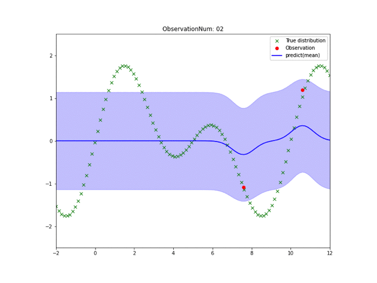
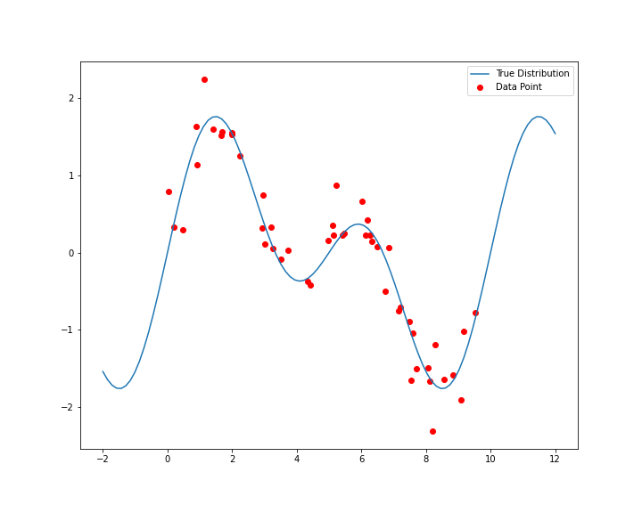
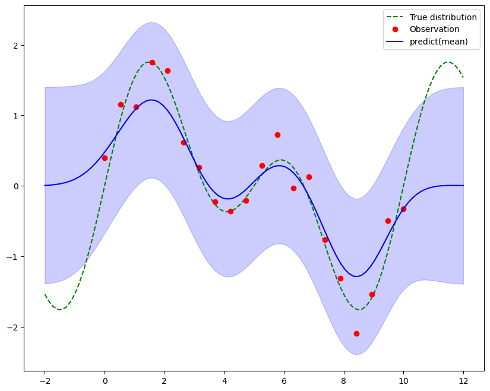
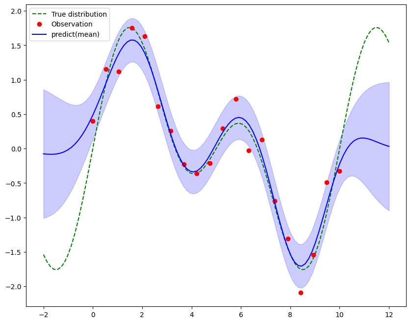
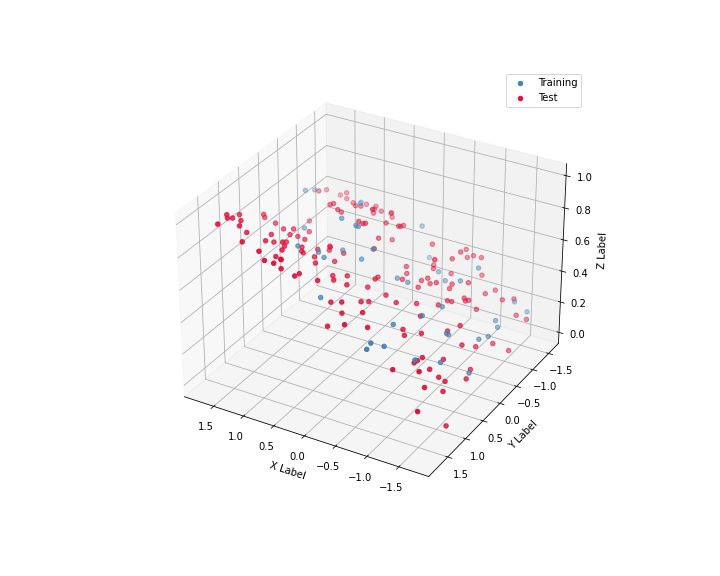
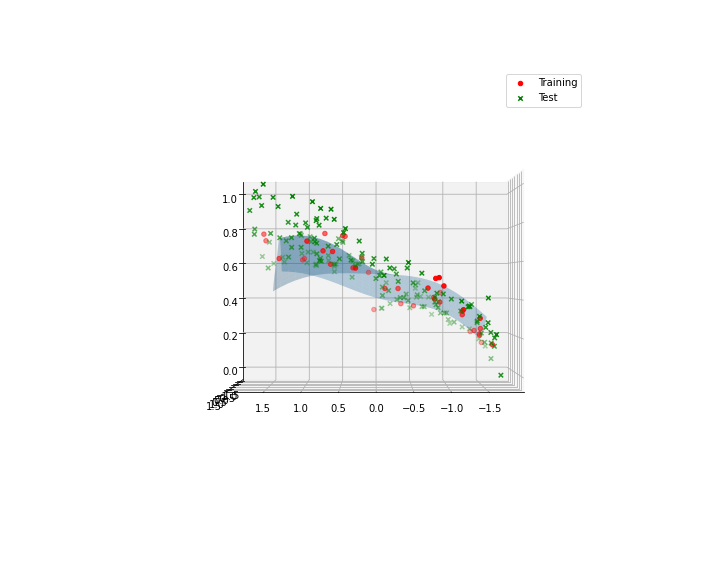

# Gaussian Process

## Description

A Python implementation of Gaussian process regression.

- Supporting multi-dimensional Gaussian process regression.
- Kernel function is a Gaussian kernel with a constant term and a linear term.

## Example

### 1 dimension data

#### Input Data

#### Regression Result

#### Regression Result(Using Optimized Parameters.)

### 2 dimension data

Using Advertising DataSet.

#### Input Data

#### Regression Result

