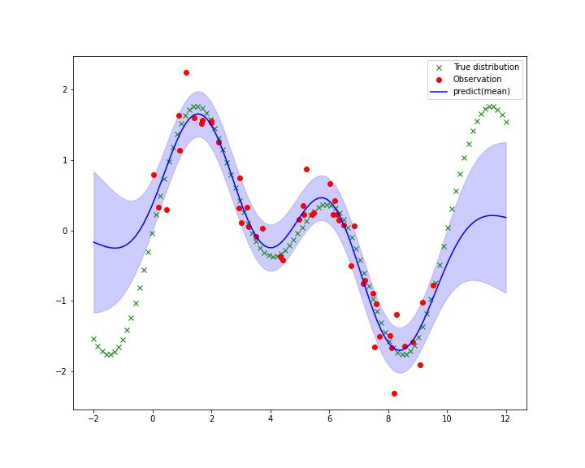

# Gaussian Process Regression


This repository provides a Python implementation of Gaussian Process Regression (GPR). It includes two versions: a standard implementation that is easy to understand and follows the textbook equations, and a computationally efficient version optimized for speed and numerical stability.

This project was created for educational purposes to deepen the understanding of Gaussian Processes.

## Features

- **Two Implementations**: Choose between a clear, educational implementation (`GPR.py`) and a high-performance one (`GPR_efficient.py`).
- **Multi-dimensional Support**: Capable of handling multi-dimensional input data.
- **Flexible Kernels**: A composite kernel including an RBF (Gaussian), constant, and linear term. The efficient version supports Automatic Relevance Determination (ARD).
- **Hyperparameter Optimization**: Built-in optimization of kernel hyperparameters using `scipy.optimize`.

## Implementations

### `GPR.py`: Standard Version

This version is a direct translation of the mathematical formulas for GPR. It is easy to follow for those learning the theory but may be slow for larger datasets due to its use of loops for matrix construction.

### `GPR_efficient.py`: Efficient Version

This version is optimized for performance and numerical stability:

- **Vectorized Operations**: Uses NumPy's vectorized operations to build kernel matrices quickly.
- **Cholesky Decomposition**: Employs Cholesky decomposition (`scipy.linalg.cho_factor`) for solving linear systems, which is faster and more stable than direct matrix inversion.
- **ARD Kernel**: Supports Automatic Relevance Determination, allowing for different length-scales for each input dimension.

## Performance Comparison

To demonstrate the performance difference between the standard and efficient implementations, the execution time for both 1D and 2D regression tasks was measured. As shown in the plots below, the efficient version (`GPR_efficient.py`) is significantly faster, especially as the number of data points increases.

**1D Regression**  


**2D Regression**  


This performance gain is achieved through vectorized operations and the use of Cholesky decomposition, making the efficient version more suitable for larger datasets.

## How to Use

This section demonstrates how to use the GPR implementations for both 1D and 2D regression tasks.

### 1D Regression Example

Here is a simple example of performing a 1D regression.

#### 1. Generate Sample Data

First, let's create a simple sine curve with some noise.

```python
import numpy as np
import matplotlib.pyplot as plt

# Generate sample data
x_train = np.linspace(-5, 5, 20).reshape(-1, 1)
y_train = np.sin(x_train).ravel() + np.random.normal(0, 0.1, x_train.shape[0])
x_test = np.linspace(-5, 5, 100).reshape(-1, 1)

# Plot the raw data
plt.figure(figsize=(8, 6))
plt.scatter(x_train, y_train, c='red', label='Observed Data')
plt.title('Input Data')
plt.xlabel('x')
plt.ylabel('y')
plt.legend()
plt.show()
```


#### 2. Perform Regression

You can choose either `GaussianProcess` or `GaussianProcessEfficient`.

##### Using the Standard `GaussianProcess`

```python
from GPR import GaussianProcess

# Initial hyperparameters
# [sigma_f^2, length_scale, bias, linear_slope]
theta = np.array([1.0, 1.0, 1.0, 1.0])
beta = 50.0 # Noise precision

# Create and train the model
gp = GaussianProcess(theta, beta, x_train, y_train)
gp.optimize() # Optimize hyperparameters

# Make predictions
mu, var = gp.prediction(x_test)
std = np.sqrt(var)

# Plot the results
plt.figure(figsize=(10, 8))
plt.scatter(x_train, y_train, c='red', label='Observed Data')
plt.plot(x_test, np.sin(x_test), 'g--', label='Ground Truth')
plt.plot(x_test, mu, 'b-', label='Predictive Mean')
plt.fill_between(x_test.ravel(), mu - std, mu + std, alpha=0.2, color='blue', label='±1 sigma')
plt.title('GPR with Optimized Parameters (Standard)')
plt.legend()
plt.show()
```



##### Using the `GaussianProcessEfficient`

The efficient implementation uses an ARD kernel, so the number of length-scale parameters in `theta` depends on the input dimension.

```python
from GPR_efficient import GaussianProcessEfficient

# For 1D data, theta is [rbf_var, length_scale, const_var, linear_var]
theta = np.array([1.0, 1.0, 1.0, 1.0])
beta = 50.0

gp_efficient = GaussianProcessEfficient(theta, beta, x_train, y_train)
gp_efficient.optimize()

mu_eff, var_eff = gp_efficient.prediction(x_test)
std_eff = np.sqrt(var_eff)

# The plot will be visually identical to the one above
```


### 2D Regression Example

This implementation also supports multi-dimensional regression. Here is an example of performing a 2D regression on the "advertising" dataset, which contains the impact of TV and Radio advertising budgets on sales.

First, we load the data and visualize it. The goal is to predict `Sales` based on `TV` and `Radio` budgets.


After training the `GaussianProcessEfficient` model, we can predict `Sales` for a range of `TV` and `Radio` budgets and visualize the result as a 3D surface.


The ARD kernel in the efficient implementation helps to identify the relevance of each input feature. For more details, please refer to the `2dim_gpr_comparison.ipynb` notebook.

## Examples

This repository contains more detailed examples:

- `1dim_gif.ipynb`: A complete 1D regression example, including hyperparameter optimization and plotting.
- `2dim_gpr_comparison.ipynb`: An example of 2D regression using the "advertising" dataset.

You can open these notebooks with Jupyter Notebook or JupyterLab to see the Gaussian Process regression in action.

## License

This project is open-source. Please feel free to use it for your own studies.
